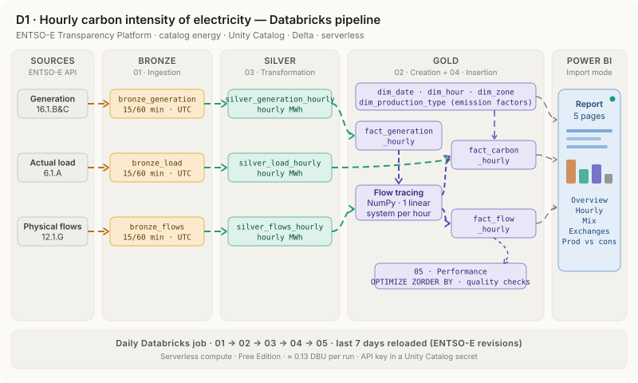
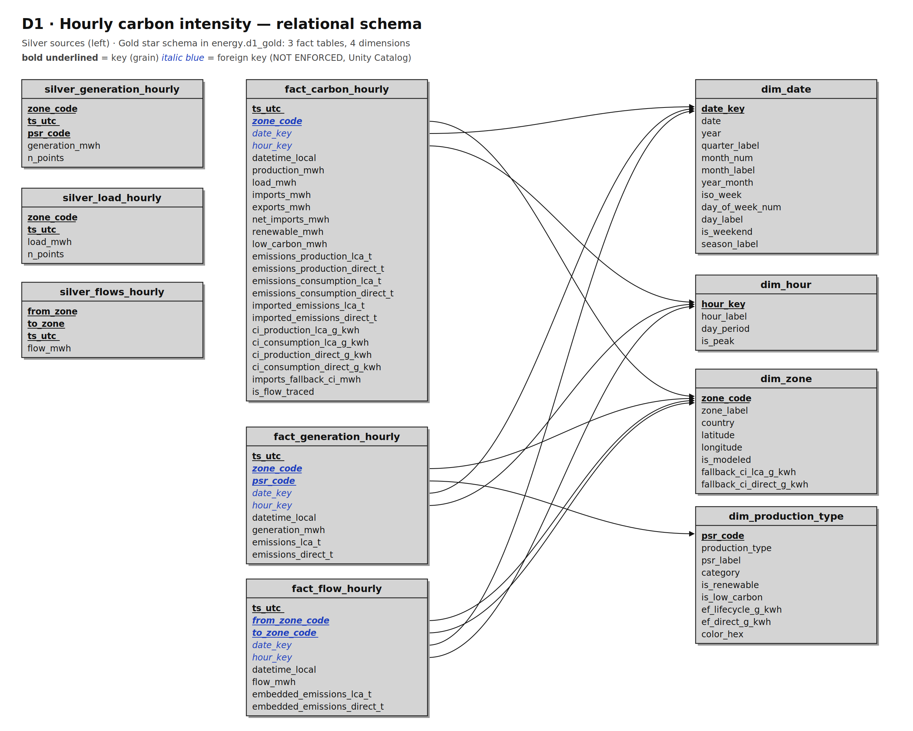

# Hourly Carbon Intensity of Electricity — Belgium and Neighbours

**ENTSO-E · Databricks · Unity Catalog · Delta Lake · Power BI**



## 1. Why and what?

The carbon intensity of electricity is usually reported as a yearly average of what a country **produces**.
But a country also imports and exports electricity every hour, so what its consumers actually **use** can be
cleaner or dirtier than its own generation — and it changes a lot between midday and evening, summer and winter.

This project builds a data warehouse on Databricks that computes, hour by hour, the carbon intensity of the
electricity **produced** and **consumed** in Belgium, France, the Netherlands and Germany-Luxembourg, taking
cross-border flows into account (*flow tracing*). The result is a star schema consumed by a Power BI report.

Questions it answers:

* **When is Belgian electricity cleanest?** Hour-by-month profile, share of hours below 100 gCO₂/kWh.
* **Do imports make Belgian consumption cleaner or dirtier?** Gap between consumption and production intensity.
* **Where does the imported CO₂ come from?** CO₂ embedded in each cross-border flow.
* **What drives the emissions?** Generation mix and emissions per production type.

### The data

ENTSO-E Transparency Platform (free API key: https://transparency.entsoe.eu), accessed with `entsoe-py`:

| Dataset | ENTSO-E article | Zones |
|---|---|---|
| Actual Generation per Production Type | 16.1.B&C | 4 modeled zones + 11 neighbours |
| Actual Total Load | 6.1.A | BE, FR, NL, DE-LU |
| Cross-Border Physical Flows | 12.1.G | every border touching a modeled zone, both directions |

## 2. Architecture

A medallion architecture on Databricks Free Edition (serverless), in the Unity Catalog catalog `energy`.

| Layer | Schema | Tables | Content |
|---|---|---|---|
| Bronze | `d1_bronze` | `bronze_generation`, `bronze_load`, `bronze_flows` | Raw ENTSO-E data, 15 or 60 min, UTC |
| Silver | `d1_silver` | `silver_generation_hourly`, `silver_load_hourly`, `silver_flows_hourly` | Hourly values (the average MW over an hour is the energy in MWh) |
| Gold | `d1_gold` | 4 dimensions, 3 fact tables | Star schema read by Power BI |

The ENTSO-E API key is never written in the code: it is stored as a Unity Catalog secret
(`energy.configschema.ENTSOE_API_KEY`) and read with `dbutils.secrets.get`.

## 3. Data model



* **Dimensions:** `dim_date` and `dim_hour` (Brussels local time), `dim_zone`, `dim_production_type`
  (with the emission factors).
* **Facts:**
  * `fact_generation_hourly` — generation and emissions per zone, hour and production type
  * `fact_carbon_hourly` — per zone and hour: production, load, imports, exports, emissions and intensities
  * `fact_flow_hourly` — each cross-border flow and the CO₂ it carries

Fact tables have no surrogate key: their key is their natural grain (e.g. `ts_utc` + `zone_code`).
`ts_utc` is the technical key, `date_key` / `hour_key` are computed in Brussels local time, which handles
daylight-saving changes cleanly. Primary and foreign keys are declared in Unity Catalog (`NOT ENFORCED`).
`fact_flow_hourly` references `dim_zone` twice (origin and destination).

## 4. Notebooks

| Notebook | What it does |
|---|---|
| `01 - Ingestion` | Calls the ENTSO-E API for the selected period and writes the Bronze tables. The period is deleted before being re-inserted, so a re-run creates no duplicates. |
| `02 - Creation` | Creates the schemas, the dimension tables (filled) and the fact tables (empty), with their keys. |
| `03 - Transformation` | Bronze → Silver: hourly aggregation. Unknown production types are counted as *Other* and flagged. |
| `04 - Insertion` | Silver → Gold: generation facts, flow tracing, carbon and flow facts. |
| `05 - Performance` | `OPTIMIZE … ZORDER BY` on the fact tables, row counts, duplicate keys and consistency checks. |

`01 - Ingestion` takes two parameters, `start_date` and `end_date` (empty = last 7 days). The first load is a
backfill, e.g. `start_date = 2024-01-01`. The other notebooks rebuild Silver and Gold from Bronze.

## 5. Method

**Emissions of generation** = generation × emission factor of the production type. Two sets of factors are kept,
switchable in Power BI:

* life-cycle (IPCC AR5 medians, gCO₂eq/kWh);
* direct combustion (closer to Scope 2 location-based reporting).

**Consumption intensity (flow tracing).** For each hour, the intensity *c* of the electricity mix of each
modeled zone *n* follows from:

```
c_n × (P_n + imports into n) = E_n + Σ over origins k of (c_k × F_k→n)
```

*P* = generation, *E* = emissions of generation, *F* = physical flows. For a modeled origin, *c_k* is unknown; for
an external one (Spain, Switzerland, Poland…) it is its production intensity, or a fallback value when its
generation is not published (Great Britain since Brexit). This gives a small linear system per hour, solved with
NumPy in `04 - Insertion`. Assumption: perfect mixing within each zone.

### Limitations

* Direct-combustion factors are orders of magnitude; official reporting should use reference factors (AIB, IEA).
* Pumped hydro and batteries are counted at 0 g/kWh when they discharge.
* The share of imports priced with a fallback intensity is monitored in `05 - Performance`.

## 6. Power BI

The report connects to the SQL warehouse (*Get data → Databricks*, Import mode) and imports the `d1_gold` tables.
Relationships, calculated tables and the DAX measures are listed in [`PowerBI_measures.md`](PowerBI_measures.md).

Report pages: Overview · Hourly profile · Generation mix · Exchanges · Production vs consumption.

<!-- Add screenshots of the report here, e.g.


-->

## 7. How to run it

1. Create a Unity Catalog catalog `energy` and a schema `configschema`.
2. Create the secret `energy.configschema.ENTSOE_API_KEY` (Catalog Explorer → *Create a new secret*) with your
   own ENTSO-E API key.
3. Import the five notebooks (or clone this repository as a Databricks Git folder).
4. Run them in order on serverless compute (environment version 4 or later, required to read Unity Catalog secrets).
5. Schedule a daily job `01 → 02 → 03 → 04 → 05` with empty dates: the last 7 days are reloaded every morning,
   which also picks up the revisions ENTSO-E publishes after the fact.

## 8. Cost

The full pipeline runs on Databricks Free Edition. A daily run uses about **0.13 DBU** of serverless notebook
compute; most of the consumption comes from the SQL warehouse when Power BI refreshes (Import mode keeps it low).

## 9. Repository structure

```
├── 01 - Ingestion.ipynb
├── 02 - Creation.ipynb
├── 03 - Transformation.ipynb
├── 04 - Insertion.ipynb
├── 05 - Performance.ipynb
├── PowerBI_measures.md
├── images/
│   ├── d1_pipeline.svg              animated pipeline diagram
│   ├── d1_pipeline.gif              same diagram as GIF
│   ├── d1_relational_schema.png     star schema
│   └── d1_relational_schema.svg
└── README.md
```

---

Part of a series of ENTSO-E studies: **D1 · Carbon intensity** · D2 · Market coupling · D3 · Adequacy.

Data: ENTSO-E Transparency Platform. Author: Fadil Yvan Ouedraogo.
